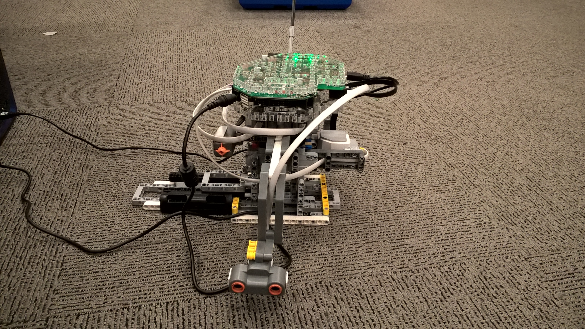
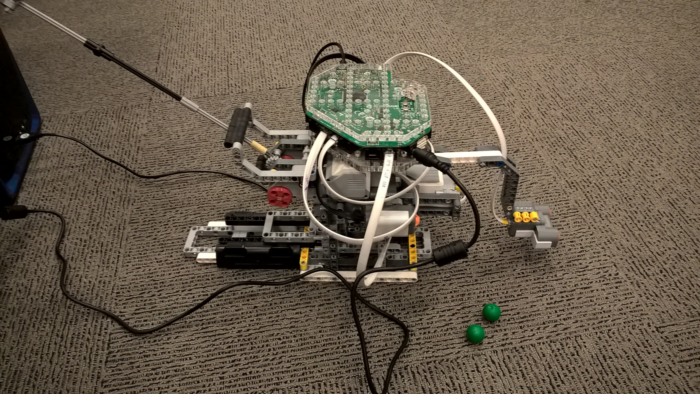

# Catapult
## Project Goals
The goal of the project was to create a device that could fire small projectiles into three separate containers.
Mechanical limitations:
-  Built from lego, including motors and sensors
-  Must shoot at least two meters
-  Minimum scanning area of 180 degrees
-  Find up to three separate targets and gauge the distance and torque required
-  Before firing, user confirmation is necessary

Software limitations:
- C programming language with husarion/lego libraries
- The microcontroller is a husarion RoboCore
- Must take the input from the sensor and decide where potential targets lie
- Calculate required torque for a given distance
- Three operating modes(Auto, Manual and Calibration)

## Design
The robot is made up of 3 motors, 1 ultrasonic sensor, 1 press button and 1 RoboCORE. Two motors are used in tandem to increase the firing torque, which helps with the precision of shots as well as increasing the range. The third motor provides the rotation of the firing lever and scanner. 

The button serves two purposes. The first is as an endstop. The endstop is used to set the zero position during initialization of the catapult and to later recalibrate the printer as we found the motors can be unreliable. The second function is as a user confirmation before tasks such as firing projectiles that can result in serious injury or even death; use of plastic balls is strongly advised.

To prevent damage to the pieces during firing, rubber dampers are provided where there is contact.

### Auto Mode
The auto mode includes a 180deg scan before deciding how many boxes there before and firing to each with user confirmation.

### Manual Mode
The user inputs the angle of shot and distance of target. The rest is computed by the robot.

### Calibration Mode
Allows easy calibration of most parameters.

